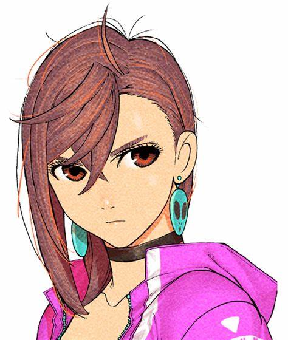

# Ollama Llama 3.2 Vision setup
This demonstration uses the Ollama Llama 3.2 and Llama 3.2 Vision models. There specifications are:
| Model              | Parameters | Size  | Download                         |
| ------------------ | ---------- | ----- | -------------------------------- |
| Llama 3.2          | 3B         | 2.0GB | `ollama run llama3.2`            |
| Llama 3.2 Vision   | 11B        | 7.9GB | `ollama run llama3.2-vision`     |

> [!NOTE]
> You should have at least 8 GB of RAM available to run the 7B models (Llama 3.2 Vision = 11B).

## Installation 
Download Ollama from the <a href="https://ollama.com/">Ollama website</a>.

Then, pull the model:
```bash
$ pull llama3.2-vision
```

## Integration with Python
Ollama is compatible with Python 3.8+. I used Python 3.13.1, the latest version for Windows. Download Python from the <a href ="https://www.python.org/downloads/">Python website</a>. 

### Virtual environment
Setup and activate a venv:
```bash
$ python -m venv my-venv
$ my-venv/Scripts/activate
```

The activation command will vary depending on the terminal client; I'm using powershell in this demo.

### Usage
Install the Python Ollama package to my-venv.
```bash
(my-venv) $ pip install ollama
```

### Python file
The following code will read an image as input from the specified path and output a text description. The image must be in a compatible format, such as .jpg. You may copy the code into your own script, or use the `example.py` file in this repo. Make sure that the `'images'` variable has a correct filepath specified.
```python
import ollama

response = ollama.chat(
    model='llama3.2-vision',
    messages=[{
        'role': 'user',
        'content': 'What is in this image?',
        'images': ['images/momo.jpg']
    }]
)

print(response)
```

Then run the code:
```bash
(my-venv) $ python example.py
```

## Example
### Input image
Momo Ayase from the anime, Dandadan.



### Output
The following gets printed to the terminal:

`model='llama3.2-vision' created_at='2024-12-07T01:39:05.0383784Z' done=True done_reason='stop' total_duration=5086385300 load_duration=23007700 prompt_eval_count=18 prompt_eval_duration=290000000 eval_count=67 eval_duration=4683000000 message=Message(role='assistant', content='This image appears to be a drawing of a female anime character. The character has brown hair with reddish highlights, and large blue earrings with black centers. She is wearing a pink hooded top and a black choker around her neck. Her eyebrows are furrowed, giving the impression that she may be upset or angry.', images=None, tool_calls=None)`

You may extract specified fields from the response, such as the message content: 

`This image appears to be a drawing of a female anime character. The character has brown hair with reddish highlights, and large blue earrings with black centers. She is wearing a pink hooded top and a black choker around her neck. Her eyebrows are furrowed, giving the impression that she may be upset or angry.'`

## Resources
#### Ollama
* https://ollama.com/

#### Ollama GitHub repo
* https://github.com/ollama/ollama

#### Ollama Python Library GitHub repo
* https://github.com/ollama/ollama-python

#### Python
* https://www.python.org/downloads/